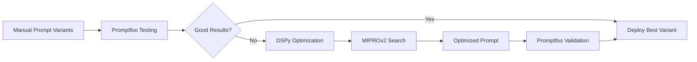

# Prompt Optimization Tools Research - November 13, 2025

## Executive Summary

Research into Python packages for LLM prompt fine-tuning and optimization to address the function count bias issue in RedditHarbor's AI profiler.

**Current Problem**: LLM profiler overcorrected from 100% 3-function bias to 100% 1-function bias.

**Target**: Achieve natural distribution (~60% 1-func, ~30% 2-func, ~10% 3-func)

---

## 🔬 Three Leading Solutions

### 1. DSPy (Stanford NLP) - **RECOMMENDED**

**Repository**: https://github.com/stanfordnlp/dspy (30k stars)
**Documentation**: https://dspy.ai
**Installation**: `pip install dspy`

#### What It Does
DSPy is a framework for **programming—not prompting—language models**. It automatically optimizes prompts and model weights using algorithms instead of manual trial-and-error.

#### Key Features
- **Automatic Few-Shot Learning**: Generates optimal examples from data
- **Instruction Optimization**: Proposes and tests better instructions automatically
- **Multiple Optimizers**:
  - `dspy.MIPROv2`: Data-aware instruction + demo optimization with Bayesian search
  - `dspy.BootstrapFewShot`: Self-generates demonstrations from teacher model
  - `dspy.COPRO`: Coordinate ascent for instruction refinement
  - `dspy.GEPA`: Reflective prompt evolution (newest, Feb 2025)

#### How It Works (MIPROv2 Example)
1. **Bootstrapping Stage**: Runs program multiple times, collects traces, filters by metric
2. **Grounded Proposal Stage**: Analyzes code/data/traces to draft instructions
3. **Discrete Search Stage**: Tests instruction combinations, updates surrogate model

#### Perfect For Our Use Case
```python
import dspy

# Define our current profiler as a DSPy module
class AppProfiler(dspy.Module):
    def __init__(self):
        self.generate = dspy.ChainOfThought("text, title, subreddit, score -> app_profile")

    def forward(self, text, title, subreddit, score):
        return self.generate(text=text, title=title, subreddit=subreddit, score=score)

# Define metric: check function count distribution
def function_count_metric(example, prediction, trace=None):
    func_count = len(prediction.app_profile.get('core_functions', []))

    # Reward natural distribution
    if func_count == 1:
        return 0.6  # Target: 60%
    elif func_count == 2:
        return 0.3  # Target: 30%
    elif func_count == 3:
        return 0.1  # Target: 10%
    else:
        return 0.0  # Penalize 0 or 4+ functions

# Optimize with MIPROv2
optimizer = dspy.MIPROv2(metric=function_count_metric, auto="medium", num_threads=24)
optimized_profiler = optimizer.compile(
    AppProfiler(),
    trainset=training_examples,
    max_bootstrapped_demos=3,
    max_labeled_demos=3
)
```

#### Integration Effort
- **Moderate** (2-4 hours initial setup)
- Requires restructuring profiler as DSPy module
- Compatible with OpenRouter/Claude Haiku (already using)
- Can run optimization overnight on 50-100 examples

#### Pros
✅ Proven at scale (10M+ users in production)
✅ Automatic optimization (less manual tuning)
✅ Can optimize both instructions AND examples
✅ Active development (Stanford NLP)
✅ Works with any LLM provider
✅ Can save/load optimized programs

#### Cons
❌ Learning curve for DSPy paradigm
❌ Requires restructuring existing code
❌ Optimization runs cost $2-10 USD per run

---

### 2. Promptfoo - **BEST FOR TESTING**

**Repository**: https://github.com/promptfoo/promptfoo (9k stars)
**Documentation**: https://www.promptfoo.dev
**Installation**: `pip install promptfoo` (also has JS version)

#### What It Does
Testing and evaluation framework for LLM prompts. More focused on **systematic testing** than automatic optimization.

#### Key Features
- **A/B Testing**: Compare multiple prompt variations side-by-side
- **Assertions & Metrics**: Define pass/fail criteria programmatically
- **Red Teaming**: Automated vulnerability scanning
- **CI/CD Integration**: Run in GitHub Actions, etc.
- **Web UI**: Visual comparison of prompt outputs

#### How It Works
```yaml
# promptfooconfig.yaml
prompts:
  - "prompts/current_prompt.txt"
  - "prompts/balanced_prompt.txt"
  - "prompts/example_heavy_prompt.txt"

providers:
  - openrouter:anthropic/claude-haiku-4.5

tests:
  - vars:
      text: "I'm frustrated with budgeting apps..."
      title: "Looking for better budgeting"
    assert:
      - type: python
        value: |
          func_count = len(json.loads(output)['core_functions'])
          1 <= func_count <= 3  # Must be 1-3 functions
      - type: javascript
        value: |
          const dist = {1: 0.6, 2: 0.3, 3: 0.1};
          const count = JSON.parse(output).core_functions.length;
          output.score = dist[count] || 0;
```

#### Perfect For Our Use Case
- Test 5-10 prompt variations simultaneously
- Track function count distribution across test cases
- Visual matrix to see which prompts work best
- Catch regressions before deployment

#### Integration Effort
- **Low** (1-2 hours)
- No code restructuring needed
- Works with current profiler as-is
- Can use Python or config files

#### Pros
✅ Simple to use (declarative config)
✅ Great visualization/UI
✅ No code changes required
✅ Fast iteration (live reload)
✅ Can track metrics over time

#### Cons
❌ Doesn't auto-optimize (manual prompt testing only)
❌ Requires writing many prompt variants yourself
❌ More focused on evaluation than improvement

---

### 3. TorchTune / LLaMA-Factory - **FOR WEIGHT FINE-TUNING**

**TorchTune**: https://github.com/meta-pytorch/torchtune
**LLaMA-Factory**: https://github.com/hiyouga/LLaMA-Factory

#### What It Does
Full model fine-tuning (weights, not just prompts). Much heavier solution than we need.

#### When to Use
- When prompt engineering isn't enough
- When you need a very small, efficient model
- When you have 1000+ training examples
- When you can afford GPU compute

#### Integration Effort
- **High** (1-2 weeks)
- Requires GPU infrastructure
- Need to prepare fine-tuning dataset
- Model deployment complexity

#### Verdict for Our Use Case
❌ **Overkill** - We're having prompt issues, not model capability issues
❌ Claude Haiku 4.5 is already capable enough
❌ Fine-tuning costs and complexity not justified

---

## 📊 Comparison Matrix

| Tool | Optimization | Testing | Learning Curve | Cost | Best For |
|------|-------------|---------|----------------|------|----------|
| **DSPy** | ✅✅✅ Automatic | ✅✅ Good | Medium | $2-10/run | Auto-optimizing prompts |
| **Promptfoo** | ❌ Manual | ✅✅✅ Excellent | Low | Free | A/B testing prompts |
| **TorchTune** | ✅✅✅ Weights | ✅ Basic | High | $50-500 | Model fine-tuning |

---

## 🎯 Recommendation for RedditHarbor

### Immediate Action (This Week)
**Use Promptfoo for rapid testing:**

1. Create 5-7 prompt variations with different:
   - Example ratios (4:2:1, 3:3:2, 2:2:2)
   - Directive strengths ("prefer", "aim for", "default to")
   - Validation questions

2. Run systematically on 20-50 test cases

3. Identify best performing variant

**Effort**: 2-4 hours
**Cost**: Free
**Expected Outcome**: Find balanced prompt empirically

### Medium-term (Next Sprint)
**Implement DSPy optimization:**

1. Refactor `llm_profiler_enhanced.py` as DSPy module

2. Define composite metric:
   ```python
   def balanced_metric(example, pred, trace=None):
       # Check function count distribution
       func_dist_score = function_distribution_score(pred)

       # Check quality (functions are well-defined)
       quality_score = function_quality_score(pred)

       # Combined score
       return 0.7 * func_dist_score + 0.3 * quality_score
   ```

3. Run `dspy.MIPROv2` optimizer on 100 examples

4. Deploy optimized version

**Effort**: 1-2 days
**Cost**: $5-20 (optimization runs)
**Expected Outcome**: Systematic prompt optimization

### Long-term (If Needed)
**Fine-tuning with BootstrapFinetune:**

Only if prompt optimization doesn't achieve target distribution.

---

## 💡 Hybrid Approach (Recommended)



**Week 1**: Promptfoo rapid testing (2-4 hours)
**Week 2**: If needed, DSPy optimization (1-2 days)
**Total Investment**: 1-3 days over 2 weeks
**Total Cost**: $5-20

---

## 📝 Implementation Checklist

### Promptfoo Setup
- [ ] Install: `npm install -g promptfoo` or `pip install promptfoo`
- [ ] Create `promptfooconfig.yaml` with 5 prompt variants
- [ ] Define 20 test cases from `app_opportunities_trust`
- [ ] Add Python assertion for function count distribution
- [ ] Run evaluation: `promptfoo eval`
- [ ] Review results in web UI: `promptfoo view`
- [ ] Select best performing prompt

### DSPy Setup (If Needed)
- [ ] Install: `pip install dspy`
- [ ] Create `dspy_profiler.py` module wrapper
- [ ] Define `function_distribution_metric`
- [ ] Prepare 100 training examples
- [ ] Configure `dspy.MIPROv2` optimizer
- [ ] Run overnight optimization
- [ ] Validate results with Promptfoo
- [ ] Deploy optimized version

---

## 🔗 Resources

### DSPy
- **Tutorial**: https://dspy.ai/tutorials/rag/
- **Optimization Guide**: https://dspy.ai/learn/optimization/optimizers/
- **Paper**: [DSPy: Compiling Declarative Language Model Calls](https://arxiv.org/abs/2310.03714)
- **Paper**: [MIPROv2: Multi-Stage Optimization](https://arxiv.org/abs/2406.11695)
- **Paper**: [GEPA: Reflective Prompt Evolution](https://arxiv.org/abs/2507.19457)

### Promptfoo
- **Docs**: https://www.promptfoo.dev/docs/intro/
- **Configuration**: https://www.promptfoo.dev/docs/configuration/guide/
- **Assertions**: https://www.promptfoo.dev/docs/configuration/expected-outputs/

### Related Research
- [Fine-Tuning and Prompt Optimization](https://arxiv.org/abs/2407.10930)
- [Prompt Engineering Framework](https://www.ianww.com/blog/2023/05/21/prompt-engineering-framework)

---

## 🎓 Key Learnings

1. **Prompt engineering is now a tractable engineering problem** with systematic tools
2. **DSPy treats prompts as code** that can be compiled and optimized
3. **Testing frameworks like Promptfoo** enable data-driven prompt selection
4. **Our current approach** (manual prompt refinement) is the old paradigm
5. **Modern approach** is test-driven prompt development with automatic optimization

---

## Next Steps

1. ✅ **Completed**: Research available tools
2. 🔄 **This Week**: Set up Promptfoo and test 5-7 prompt variants
3. ⏭️ **Next Week**: If needed, implement DSPy optimization
4. 📊 **Ongoing**: Track function count distribution in production

---

**Author**: AI Assistant (Claude Sonnet 4.5)
**Date**: November 13, 2025
**Related Document**: `docs/bias/3-function-bias-fix-2025-11-13.md`
