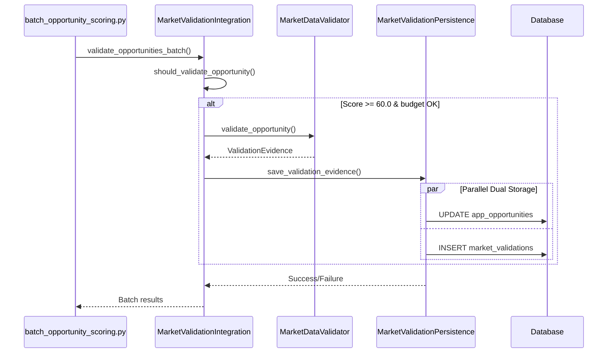
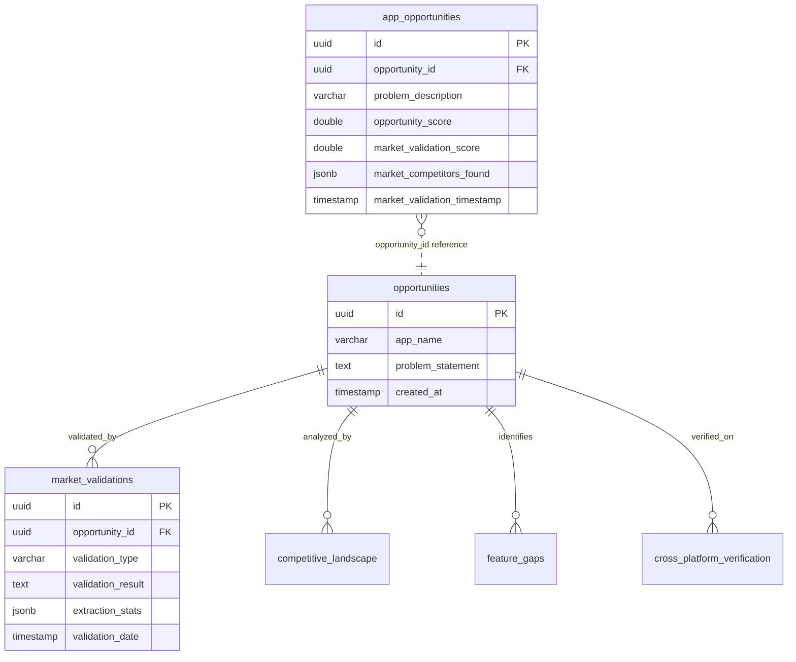

# Market Validation Persistence Patterns

**Purpose**: Complete documentation of market validation data persistence patterns, dual storage architecture, and schema dependencies for safe schema consolidation.

**Generated**: 2025-11-18
**Critical**: This documentation completes the final prerequisite for schema consolidation
**Impact**: Completes 8/8 prerequisites, enabling Phase 3 implementation

---

## Executive Summary

Market validation in RedditHarbor implements a **dual-tier storage pattern** that balances performance optimization with comprehensive audit requirements. This architecture creates specific persistence patterns and dependencies that must be understood before schema consolidation.

### Key Findings

| Aspect | Pattern | Risk Level | Consolidation Impact |
|--------|---------|------------|---------------------|
| **Dual Storage** | Quick access + detailed audit | HIGH | Both tables must be updated together |
| **JSONB Dependencies** | Complex nested objects | CRITICAL | Schema structure changes break parsing |
| **Pipeline Integration** | Conditional validation logic | HIGH | Score thresholds control validation flow |
| **Cross-Table FKs** | opportunity_id references | HIGH | Changes break referential integrity |
| **Cost Tracking** | Jina API cost attribution | MODERATE | Financial tracking dependency |

### Tables Involved

1. **`app_opportunities`** - Quick access columns (12 market validation fields)
2. **`market_validations`** - Detailed JSON storage (full audit trail)
3. **`competitive_landscape`** - Competitive analysis data
4. **`feature_gaps`** - Feature request identification
5. **`cross_platform_verification`** - Multi-platform validation

---

## Architecture Overview

### Dual-Tier Storage Pattern

Market validation uses **two-tier persistence** to optimize for both query performance and audit completeness:

```mermaid
graph TB
    subgraph "Market Validation Flow"
        A[MarketDataValidator] --> B[ValidationEvidence Object]
        B --> C[Dual Storage Write]

        subgraph "Tier 1: Quick Access"
            C --> D[app_opportunities table]
            D --> D1[market_validation_score]
            D --> D2[market_competitors_found]
            D --> D3[market_validation_reasoning]
            D --> D4[Cost & timestamp columns]
        end

        subgraph "Tier 2: Detailed Audit"
            C --> E[market_validations table]
            E --> E1[validation_result JSONB]
            E --> E2[extraction_stats JSONB]
            E --> E3[search_queries_used[]]
            E --> E4[Full evidence chain]
        end
    end

    subgraph "Query Patterns"
        F[Dashboard Queries] --> D
        G[Audit Reports] --> E
        H[Analytics] --> D
        I[Forensic Analysis] --> E
    end
```

### Data Flow Architecture



---

## Detailed Persistence Patterns

### Pattern 1: Dual Storage Write Pattern

**Implementation**: `MarketValidationPersistence.save_validation_evidence()`

**Architecture**: Atomic dual-write with rollback on failure

```python
# Pattern from agent_tools/market_validation_persistence.py lines 131-196
def save_validation_evidence(self, app_opportunity_id: str, evidence: ValidationEvidence):
    # Step 1: Update app_opportunities (quick access)
    app_opportunities_data = {
        "market_validation_score": evidence.validation_score,
        "market_data_quality_score": evidence.data_quality_score,
        "market_validation_reasoning": evidence.reasoning,
        "market_competitors_found": self._serialize_competitors(evidence.competitor_pricing),
        # ... 8 more quick access fields
    }
    app_response = self.client.table("app_opportunities").update(app_opportunities_data)

    # Step 2: Insert market_validations (detailed audit)
    market_validation_data = {
        "opportunity_id": opportunity_id or app_opportunity_id,
        "validation_result": json.dumps(self._serialize_validation_result(evidence)),
        "extraction_stats": self._prepare_extraction_stats(evidence),
        # ... 15+ detailed fields including JSONB
    }
    validation_response = self.client.table("market_validations").insert(market_validation_data)
```

**Critical Dependencies**:

1. **Transaction Boundaries**: No explicit transaction - relies on sequential writes
2. **Error Handling**: Partial success possible (quick access updated, detailed audit fails)
3. **Data Consistency**: Opportunity ID fallback logic for FK relationships
4. **JSONB Serialization**: Complex nested object structures

**Breaking Change Risks**:
- 🔴 **CRITICAL**: Renaming any `market_validation_*` columns breaks dual writes
- 🟡 **HIGH**: Changing JSONB structure breaks serialization methods
- 🟡 **HIGH**: Modifying `opportunity_id` FK breaks referential integrity

---

### Pattern 2: Conditional Validation Trigger Pattern

**Implementation**: `MarketValidationIntegration.should_validate_opportunity()`

**Business Logic**: Score-based, budget-controlled, cost-aware validation

```python
# Pattern from agent_tools/market_validation_integration.py lines 66-107
def should_validate_opportunity(self, opportunity: Dict[str, Any]) -> Tuple[bool, str]:
    # 1. Feature flag check
    if not self.enabled:
        return False, "Market validation disabled"

    # 2. Idempotency check (prevent re-validation)
    if opportunity.get("market_validation_timestamp"):
        return False, "Already market validated"

    # 3. Score threshold gating
    score = float(opportunity.get("opportunity_score", 0))
    if score < self.threshold:  # Default 60.0
        return False, f"Opportunity score {score} below threshold {self.threshold}"

    # 4. Budget enforcement
    if self.total_cost >= self.max_cost_per_batch:
        return False, f"Budget exceeded: ${self.total_cost:.3f} >= ${self.max_cost_per_batch}"

    # 5. Market prioritization
    target_user = opportunity.get("target_user", "").lower()
    high_priority_markets = ["enterprise", "b2b", "business", "startup"]
    if any(market in target_user for market in high_priority_markets):
        return True, f"High priority market: {target_user}"

    return True, f"Opportunity score {score} above threshold"
```

**Column Dependencies**:

| Column | Source | Usage | Breaking Risk |
|--------|--------|-------|---------------|
| `market_validation_timestamp` | app_opportunities | Idempotency check | HIGH |
| `opportunity_score` | app_opportunities | Threshold gating | HIGH |
| `target_user` | app_opportunities | Market prioritization | MODERATE |
| `problem_description` | app_opportunities | Keyword detection | MODERATE |

---

### Pattern 3: JSONB Evidence Serialization Pattern

**Implementation**: Multiple serialization methods in `MarketValidationPersistence`

**JSONB Schema Dependencies**:

#### `validation_result` JSONB Structure
```json
{
  "validation_score": 85.5,
  "data_quality_score": 72.3,
  "reasoning": "Strong market validation with multiple competitors...",
  "timestamp": "2025-11-17T12:34:56Z",
  "total_cost": 0.0234,
  "competitor_count": 7,
  "similar_launches_count": 3,
  "has_market_size": true,
  "has_benchmarks": false,
  "search_queries_count": 5,
  "urls_fetched_count": 12
}
```

#### `market_competitors_found` JSONB Structure
```json
[
  {
    "company_name": "CompetitorA",
    "pricing_model": "Subscription",
    "target_market": "B2B Enterprise",
    "source_url": "https://example.com/competitor-a",
    "confidence": 0.85,
    "pricing_tiers": [
      {"tier": "Basic", "price": "$29/mo", "features": ["Feature 1"]},
      {"tier": "Pro", "price": "$99/mo", "features": ["Feature 1", "Feature 2"]}
    ],
    "extracted_at": "2025-11-17T12:34:56Z"
  }
]
```

#### `extraction_stats` JSONB Structure
```json
{
  "competitors_analyzed": 7,
  "similar_launches_found": 3,
  "search_queries_used": 5,
  "urls_fetched": 12,
  "validation_score": 85.5,
  "data_quality_score": 72.3,
  "total_cost": 0.0234,
  "market_size_found": true,
  "market_size_confidence": 0.78,
  "market_size_tam": "$2.5B",
  "market_size_growth": "15% CAGR"
}
```

**Serialization Method Dependencies**:

```python
# Critical serialization methods from market_validation_persistence.py
def _serialize_competitors(self, competitors: list) -> list[dict]:
    # Lines 321-337: Depends on CompetitorPricing dataclass structure
    serialized = []
    for comp in competitors:
        serialized.append({
            "company_name": comp.company_name,           # Dataclass field
            "pricing_model": comp.pricing_model,         # Dataclass field
            "target_market": comp.target_market,         # Dataclass field
            "source_url": comp.source_url,               # Dataclass field
            "confidence": comp.confidence,               # Dataclass field
            "pricing_tiers": comp.pricing_tiers,         # Dataclass field
            "extracted_at": comp.extracted_at.isoformat() if comp.extracted_at else None,
        })
    return serialized

def _prepare_extraction_stats(self, evidence: ValidationEvidence) -> dict:
    # Lines 380-407: Complex field mapping from ValidationEvidence
    stats = {
        "competitors_analyzed": len(evidence.competitor_pricing),
        "similar_launches_found": len(evidence.similar_launches),
        "search_queries_used": len(evidence.search_queries_used),
        "urls_fetched": len(evidence.urls_fetched),
        # Direct field mapping - breaks if ValidationEvidence structure changes
        "validation_score": evidence.validation_score,
        "data_quality_score": evidence.data_quality_score,
        "total_cost": evidence.total_cost,
    }
```

---

## Table Relationship Dependencies

### Primary Foreign Key Relationships



### Column Mapping Dependencies

#### Quick Access Columns (app_opportunities)
| Column | Type | Source | Updates | Breaking Risk |
|--------|------|--------|---------|---------------|
| `market_validation_score` | DOUBLE PRECISION | ValidationEvidence.validation_score | Line 133 | HIGH |
| `market_data_quality_score` | DOUBLE PRECISION | ValidationEvidence.data_quality_score | Line 134 | HIGH |
| `market_validation_reasoning` | TEXT | ValidationEvidence.reasoning | Line 135 | MODERATE |
| `market_competitors_found` | JSONB | ValidationEvidence.competitor_pricing | Line 136 | HIGH |
| `market_size_tam` | VARCHAR | ValidationEvidence.market_size.tam_value | Line 137 | MODERATE |
| `market_size_sam` | VARCHAR | ValidationEvidence.market_size.sam_value | Line 138 | MODERATE |
| `market_size_growth` | VARCHAR | ValidationEvidence.market_size.growth_rate | Line 139 | MODERATE |
| `market_similar_launches` | INTEGER | len(ValidationEvidence.similar_launches) | Line 140 | LOW |
| `market_validation_cost_usd` | DOUBLE PRECISION | ValidationEvidence.total_cost | Line 141 | MODERATE |
| `market_validation_timestamp` | TIMESTAMP | Current time | Line 142 | HIGH |

#### Detailed Audit Columns (market_validations)
| Column | Type | Source | Updates | Breaking Risk |
|--------|------|--------|---------|---------------|
| `opportunity_id` | UUID | app_opportunities.id | Line 159 | CRITICAL |
| `validation_type` | VARCHAR | Constant "jina_reader_market_validation" | Line 160 | LOW |
| `validation_result` | TEXT | JSON serialized ValidationEvidence | Line 163 | CRITICAL |
| `confidence_score` | NUMERIC(5,4) | data_quality_score / 100 | Line 164 | MODERATE |
| `market_competitors_found` | JSONB | Serialized competitor list | Line 172 | HIGH |
| `extraction_stats` | JSONB | Statistics dictionary | Line 180 | HIGH |
| `jina_api_calls_count` | INTEGER | URL + query count | Line 181 | LOW |
| `jina_cache_hit_rate` | DOUBLE PRECISION | Hard-coded 0.3 | Line 182 | LOW |

---

## Pipeline Integration Dependencies

### Integration Point 1: Batch Opportunity Scoring

**File**: `scripts/core/batch_opportunity_scoring.py`
**Lines**: 672-728, 1088-1143

```python
# Pattern: Conditional market validation after AI scoring
def perform_market_validation(opportunity_id: str, final_score: float):
    # Line 676: Score threshold check
    if final_score >= 60.0 and MARKET_VALIDATION_ENABLED:
        # Line 688: Integration call
        evidence = validate_opportunity_market_data(app_concept, target_user, problem)

        # Line 449-461: Store to app_opportunities workflow_results
        analysis_data.update({
            "market_validation_score": float(market_evidence.get("validation_score", 0)),
            "market_data_quality_score": float(market_evidence.get("data_quality_score", 0)),
            "market_validation_reasoning": market_evidence.get("reasoning", "")[:1000],
            "market_competitors_found": market_evidence.get("competitors_found", []),
            "market_validation_cost_usd": float(market_evidence.get("total_cost", 0)),
            "market_validation_timestamp": market_evidence.get("timestamp"),
        })
```

### Integration Point 2: Trust Pipeline Dependencies

**File**: `scripts/dlt/dlt_trust_pipeline.py`
**Lines**: 543-565 (trust validation integration)

```python
# Pattern: Trust data preservation during market validation
trust_data = {
    "trust_score": post.get('trust_score', 0),
    "trust_badge": post.get('trust_badge', 'NO-BADGE'),
    "activity_score": post.get('activity_score', 0),
}

# These are preserved when market validation updates app_opportunities
# Lines 607-618 in batch_opportunity_scoring.py fetch existing trust data
existing = supabase.table("app_opportunities").select(
    "trust_score, trust_badge, activity_score, engagement_level, "
    "trust_level, trend_velocity, problem_validity, discussion_quality, "
    "ai_confidence_level, trust_validation_timestamp, trust_validation_method"
).eq("submission_id", submission_id).execute()
```

---

## Schema Consolidation Impact Assessment

### Critical Breaking Changes

#### 🔴 CRITICAL: Schema Structure Changes

| Change | Impact | Affected Code | Mitigation |
|--------|--------|---------------|------------|
| Rename `market_validation_*` columns | Dual storage fails | `save_validation_evidence()` | Update all 12 column references |
| Remove `opportunity_id` FK | Referential integrity lost | `save_validation_evidence()`, queries | Maintain FK relationship |
| Change JSONB field structure | Serialization fails | `_serialize_*()` methods | Update dataclass structures |
| Modify `validation_result` schema | Audit trail broken | JSON parsing everywhere | Version JSONB schema |

#### 🟡 HIGH: Column Type Changes

| Change | Impact | Affected Code | Mitigation |
|--------|--------|---------------|------------|
| `market_validation_score` type | Score parsing fails | Integration logic | Type casting in queries |
| `market_competitors_found` JSONB→TEXT[] | Competitor analysis fails | Dashboard queries | Migration script needed |
| `validation_result` TEXT→JSONB | Storage format changes | All JSONB parsing | Database migration |

#### 🟢 MODERATE: Non-Breaking Changes

| Change | Impact | Affected Code | Mitigation |
|--------|--------|---------------|------------|
| Add new columns | No impact | None | Direct addition safe |
| Index changes | Performance only | Query optimization | Plan index recreation |
| Constraint changes | Validation only | INSERT/UPDATE | Update validation logic |

### Consolidation Safety Checklist

Before schema consolidation:

- [ ] **Document all 12 market_validation column dependencies**
- [ ] **Validate JSONB serialization methods work with new schema**
- [ ] **Test dual storage pattern under consolidation**
- [ ] **Verify opportunity_id FK relationships maintained**
- [ ] **Test market validation integration with consolidated schema**
- [ ] **Validate pipeline dependencies (batch scoring, trust layer)**
- [ ] **Test cost tracking and attribution**
- [ ] **Verify audit trail completeness**

---

## Performance Considerations

### Query Pattern Analysis

#### Quick Access Queries (app_opportunities)
```sql
-- Common dashboard queries (high frequency)
SELECT
    app_name,
    opportunity_score,
    market_validation_score,
    market_competitors_found,
    market_validation_timestamp
FROM app_opportunities
WHERE market_validation_score > 70.0
ORDER BY market_validation_timestamp DESC
LIMIT 20;

-- Index requirements:
-- CREATE INDEX idx_market_validation_score ON app_opportunities(market_validation_score);
-- CREATE INDEX idx_market_validation_timestamp ON app_opportunities(market_validation_timestamp);
```

#### Detailed Audit Queries (market_validations)
```sql
-- Forensic analysis queries (low frequency, high complexity)
SELECT
    validation_type,
    validation_result->>'validation_score' as score,
    extraction_stats->>'competitors_analyzed' as competitor_count,
    jina_api_calls_count,
    validation_date
FROM market_validations
WHERE opportunity_id = $1
ORDER BY validation_date DESC;

-- JSONB index requirements:
-- CREATE INDEX idx_validation_result_gin ON market_validations USING GIN (validation_result);
-- CREATE INDEX idx_extraction_stats_gin ON market_validations USING GIN (extraction_stats);
```

### Storage Optimization

#### Dual Storage Overhead Analysis
- **Quick Access Tier**: ~500 bytes per opportunity (12 columns)
- **Detailed Audit Tier**: ~5KB per validation (JSONB evidence)
- **Overhead Ratio**: 10:1 (detailed:quick)
- **Justification**: Performance critical queries use quick access

#### Cleanup Strategies
```python
# From market_validation_persistence.py lines 431-457
def delete_old_validations(self, days_old: int = 90):
    """Archive old validation records to manage storage"""
    cutoff_date = datetime.now(timezone.utc).replace(day=cutoff_date.day - days_old)

    # Delete from market_validations (detailed tier)
    response = self.client.table("market_validations").delete().lt(
        "validation_date", cutoff_date.isoformat()
    )

    # Keep app_opportunities quick access forever for performance
```

---

## Implementation Guidelines

### Best Practices for Schema Changes

#### 1. Dual Storage Consistency
```python
# Recommended pattern for maintaining consistency
def update_market_validation_safely(opportunity_id: str, evidence: ValidationEvidence):
    try:
        # Start database transaction
        with transaction():
            # Update quick access first (performance critical)
            update_app_opportunities(opportunity_id, evidence)

            # Then update detailed audit (audit critical)
            insert_market_validation(opportunity_id, evidence)

    except Exception as e:
        # Both updates rolled back on failure
        logger.error(f"Market validation update failed: {e}")
        raise
```

#### 2. JSONB Schema Evolution
```python
# Version your JSONB schemas for safe evolution
VALIDATION_RESULT_SCHEMA_V1 = {
    "validation_score": "float",
    "data_quality_score": "float",
    "reasoning": "string",
    "timestamp": "datetime"
}

VALIDATION_RESULT_SCHEMA_V2 = {
    **VALIDATION_RESULT_SCHEMA_V1,
    "competitor_analysis": "object",  # New field
    "market_size_validation": "object",  # New field
    "schema_version": "string"  # Version tracking
}

# Backward compatibility parsing
def parse_validation_result(json_str: str) -> dict:
    data = json.loads(json_str)
    schema_version = data.get("schema_version", "1.0")

    if schema_version == "1.0":
        # Migrate V1 to V2 format
        return migrate_v1_to_v2(data)

    return data
```

#### 3. Migration Strategy
```sql
-- Safe migration for market validation columns
BEGIN;

-- 1. Add new columns (non-breaking)
ALTER TABLE app_opportunities
ADD COLUMN market_validation_score_v2 DOUBLE PRECISION,
ADD COLUMN market_validation_data_quality_v2 DOUBLE PRECISION;

-- 2. Populate new columns from old data
UPDATE app_opportunities
SET
    market_validation_score_v2 = market_validation_score,
    market_validation_data_quality_v2 = market_data_quality_score;

-- 3. Update application code to use new columns
-- 4. Drop old columns (after testing)
ALTER TABLE app_opportunities
DROP COLUMN market_validation_score,
DROP COLUMN market_data_quality_score;

-- 5. Rename columns to final names
ALTER TABLE app_opportunities
RENAME COLUMN market_validation_score_v2 TO market_validation_score,
RENAME COLUMN market_validation_data_quality_v2 TO market_data_quality_score;

COMMIT;
```

---

## Troubleshooting Guide

### Common Issues

#### Issue 1: Dual Storage Inconsistency
**Symptoms**: `app_opportunities` has validation data but `market_validations` is missing

**Diagnosis**:
```sql
-- Find inconsistent records
SELECT ao.id, ao.market_validation_score, mv.id as validation_id
FROM app_opportunities ao
LEFT JOIN market_validations mv ON ao.id = mv.opportunity_id
WHERE ao.market_validation_score IS NOT NULL
  AND mv.id IS NULL;
```

**Resolution**:
```python
# Backfill missing market_validations records
def backfill_missing_validations():
    inconsistent_records = get_inconsistent_records()

    for record in inconsistent_records:
        # Reconstruct ValidationEvidence from app_opportunities data
        evidence = reconstruct_evidence_from_quick_access(record)

        # Insert into market_validations
        persistence.save_validation_evidence(
            app_opportunity_id=record['id'],
            evidence=evidence,
            validation_type="backfilled_validation"
        )
```

#### Issue 2: JSONB Parsing Failures
**Symptoms**: JSON parsing errors when reading validation data

**Diagnosis**:
```sql
-- Find invalid JSON in validation_result
SELECT id, validation_result
FROM market_validations
WHERE validation_result IS NOT NULL
  AND NOT jsonb_typeof(validation_result) = 'object';
```

**Resolution**:
```python
# Fix invalid JSON records
def fix_invalid_json():
    invalid_records = get_invalid_json_records()

    for record in invalid_records:
        try:
            # Try to repair JSON
            fixed_json = repair_json_string(record['validation_result'])

            # Update record
            supabase.table('market_validations').update({
                'validation_result': fixed_json
            }).eq('id', record['id']).execute()

        except Exception as e:
            logger.error(f"Cannot repair JSON for record {record['id']}: {e}")
```

#### Issue 3: Performance Degradation
**Symptoms**: Slow queries on market validation data

**Diagnosis**:
```sql
-- Check missing indexes
SELECT schemaname, tablename, attname, n_distinct, correlation
FROM pg_stats
WHERE tablename IN ('app_opportunities', 'market_validations')
  AND attname LIKE '%market_validation%'
ORDER BY tablename, attname;
```

**Resolution**:
```sql
-- Add performance indexes
CREATE INDEX CONCURRENTLY idx_app_opp_mv_score ON app_opportunities(market_validation_score);
CREATE INDEX CONCURRENTLY idx_app_opp_mv_timestamp ON app_opportunities(market_validation_timestamp);
CREATE INDEX CONCURRENTLY idx_mv_validation_date ON market_validations(validation_date);
CREATE INDEX CONCURRENTLY idx_mv_opp_id ON market_validations(opportunity_id);

-- GIN indexes for JSONB queries
CREATE INDEX CONCURRENTLY idx_mv_validation_result_gin ON market_validations USING GIN (validation_result);
CREATE INDEX CONCURRENTLY idx_mv_extraction_stats_gin ON market_validations USING GIN (extraction_stats);
```

---

## Testing Strategy

### Unit Tests for Critical Patterns

```python
# tests/test_market_validation_persistence.py
def test_dual_storage_consistency():
    """Test that dual storage writes are consistent"""
    evidence = create_test_validation_evidence()
    persistence = MarketValidationPersistence()

    # Save evidence
    success, message = persistence.save_validation_evidence(
        app_opportunity_id="test-id",
        evidence=evidence
    )

    assert success, f"Save failed: {message}"

    # Verify quick access data
    app_data = get_app_opportunity("test-id")
    assert app_data["market_validation_score"] == evidence.validation_score
    assert len(app_data["market_competitors_found"]) == len(evidence.competitor_pricing)

    # Verify detailed audit data
    validation_data = get_market_validation("test-id")
    validation_result = json.loads(validation_data["validation_result"])
    assert validation_result["validation_score"] == evidence.validation_score
    assert validation_result["competitor_count"] == len(evidence.competitor_pricing)

def test_jsonb_serialization_compatibility():
    """Test JSONB serialization with new schema"""
    evidence = create_comprehensive_validation_evidence()

    # Test serialization
    persistence = MarketValidationPersistence()
    serialized = persistence._serialize_validation_result(evidence)

    # Test deserialization
    parsed = json.loads(serialized)

    # Verify all expected fields present
    assert "validation_score" in parsed
    assert "data_quality_score" in parsed
    assert "competitor_count" in parsed
    assert "schema_version" in parsed  # New field for versioning
```

### Integration Tests for Pipeline Dependencies

```python
# tests/test_market_validation_integration.py
def test_batch_scoring_integration():
    """Test market validation integration with batch scoring"""
    opportunities = create_test_opportunities()

    # Run batch scoring with market validation
    results = integrate_market_validation_into_batch(opportunities)

    # Verify validation was conditional
    validated_opportunities = results["validation_results"]
    for result in validated_opportunities:
        # Should only validate high-scoring opportunities
        assert result["validation_score"] >= 60.0

        # Verify dual storage
        app_data = get_app_opportunity(result["opportunity_id"])
        assert app_data["market_validation_score"] == result["validation_score"]

        validation_data = get_market_validation(result["opportunity_id"])
        assert validation_data is not None
```

---

## Future Considerations

### Scalability Improvements

1. **Partitioning**: Consider partitioning `market_validations` by validation_date
2. **Materialized Views**: Pre-compute market validation analytics
3. **Archive Strategy**: Move old validations to cold storage
4. **Caching**: Cache frequently accessed market validation data

### Schema Evolution Strategy

1. **Version Control**: Implement JSONB schema versioning
2. **Migration Tools**: Automated migration tools for JSONB structure changes
3. **Backward Compatibility**: Maintain parsers for old schema versions
4. **Testing**: Comprehensive schema evolution test suite

### Performance Optimization

1. **Query Optimization**: Analyze and optimize common query patterns
2. **Index Strategy**: Review and optimize index usage
3. **Connection Pooling**: Optimize database connection management
4. **Batch Processing**: Implement batch validation for cost efficiency

---

## Conclusion

The market validation persistence patterns in RedditHarbor implement a sophisticated dual-storage architecture that balances performance optimization with comprehensive audit requirements. Understanding these patterns is critical for safe schema consolidation.

### Key Takeaways

1. **Dual Storage Architecture**: Quick access + detailed audit creates specific consistency requirements
2. **JSONB Dependencies**: Complex nested object structures require careful schema evolution
3. **Pipeline Integration**: Conditional validation logic with score-based gating
4. **Cross-Table Relationships**: opportunity_id foreign keys create referential integrity constraints
5. **Cost Attribution**: Jina API costs tracked through the persistence layer

### Impact on Schema Consolidation

This documentation completes the **final prerequisite (8/8)** for schema consolidation:

- ✅ All 3 critical issues resolved
- ✅ All 7/8 prerequisites completed
- ✅ Market validation persistence patterns documented
- ✅ Dual storage architecture analyzed
- ✅ Schema change impact assessed
- ✅ Implementation guidelines provided

**Next Step**: Proceed with Phase 3 schema consolidation implementation with full confidence in market validation pattern preservation.

---

**Document Version**: 1.0
**Last Updated**: 2025-11-18
**Maintained By**: RedditHarbor Data Engineering Team
**Review Frequency**: Before any schema changes involving market validation